# Тестування працездатності системи

### Тестування за допомогою розширення VsCode - Thunder Client

### Запуск сервера

    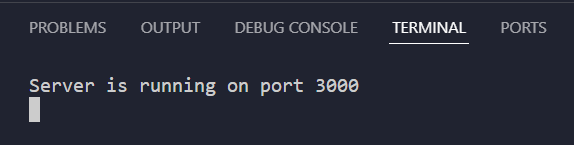

### GET /multichoice

    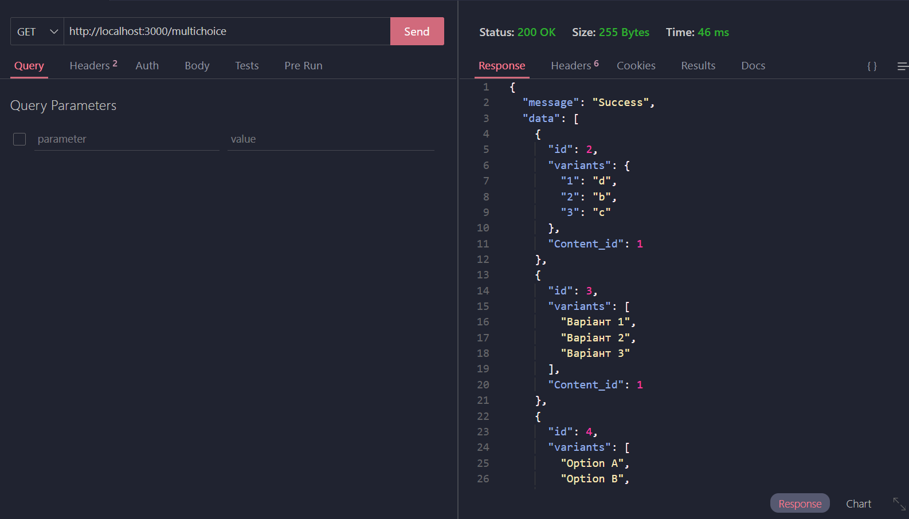

### GET /singlecohice

    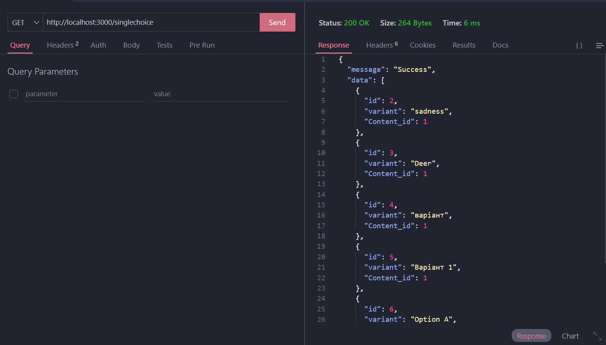

### GET /multichoice/:id

    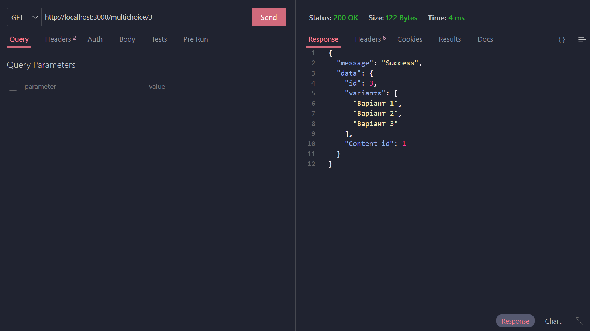

### GET /singlechoice/:id

    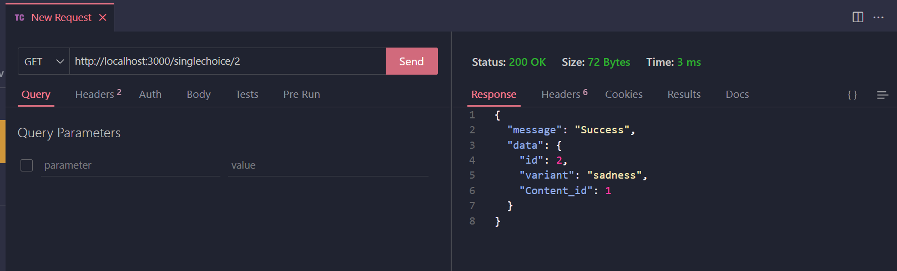

### POST /multichoice

    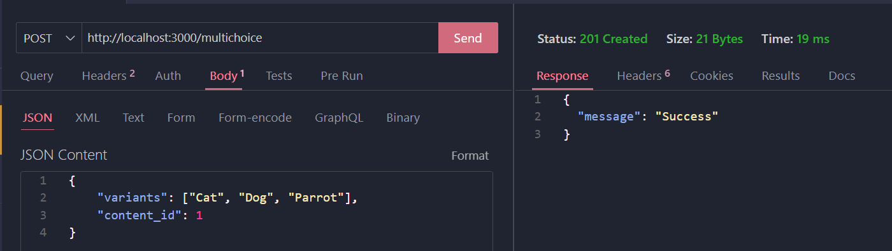

    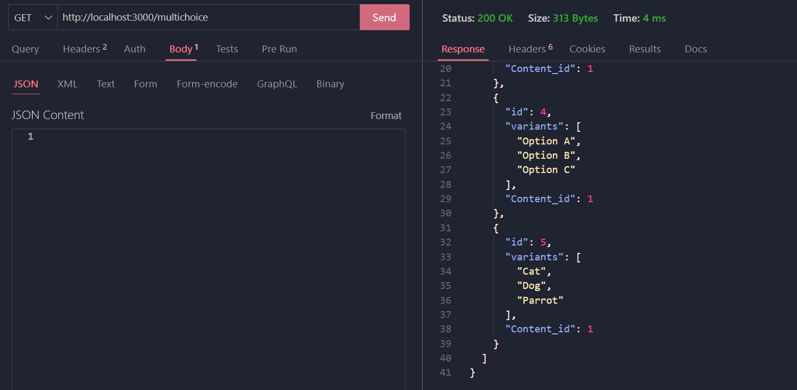

### POST /singlechoice

    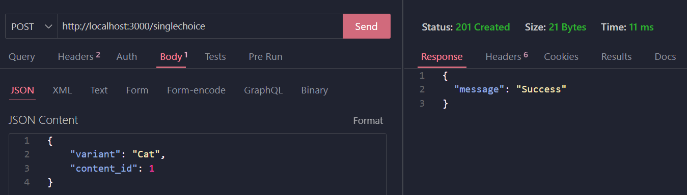

    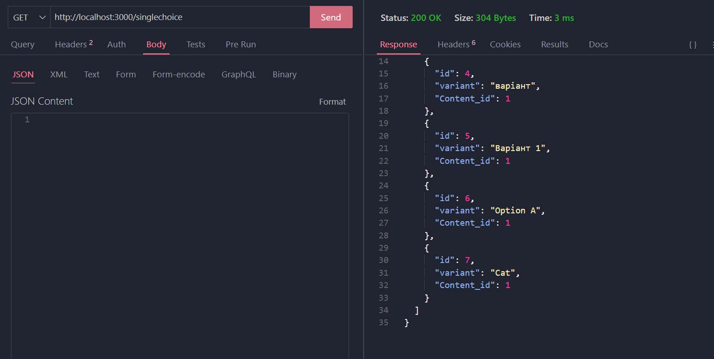

### PUT /multichoice/:id

    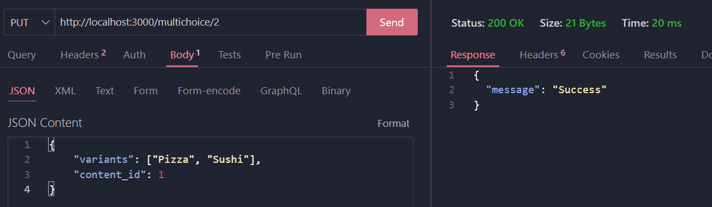

    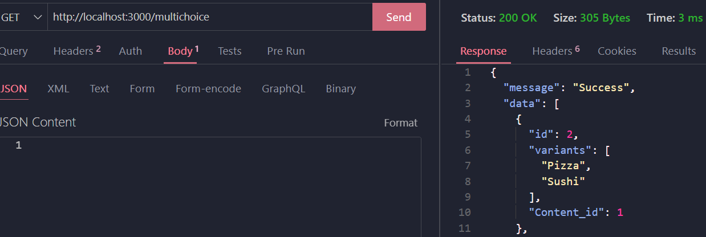

### PUT /singlichoice/:id

    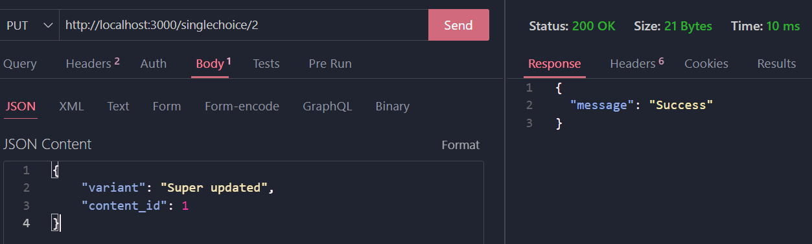

    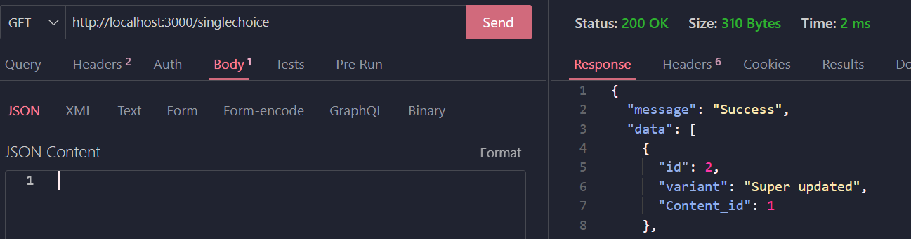

### DELETE /multichoice/:id

    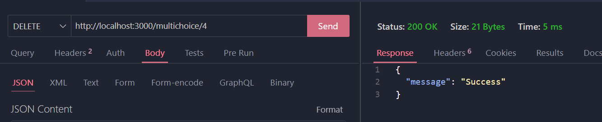

### DELETE /singlechoice/:id

    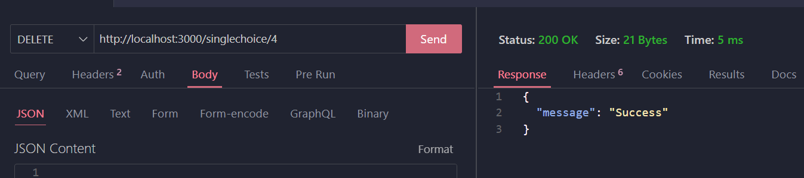

### GET з неправильним id, multichoice

    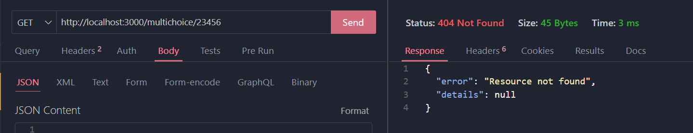

### GET з неправильним id, singlechoice

    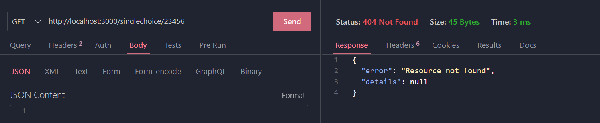

### POST без полів (або недостатньо полів), multichoice

    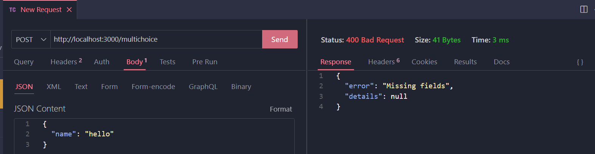

### POST без полів (або недостатньо полів), singlechoice

    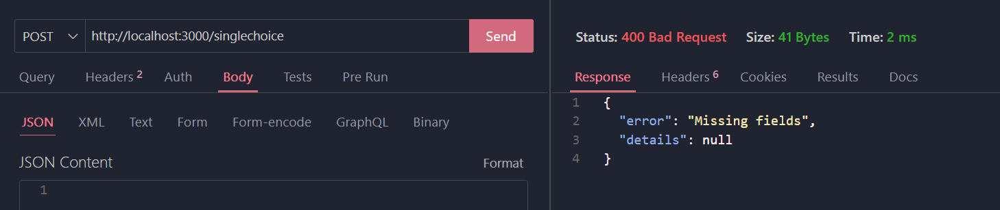

### PUT без полів, multichoice

    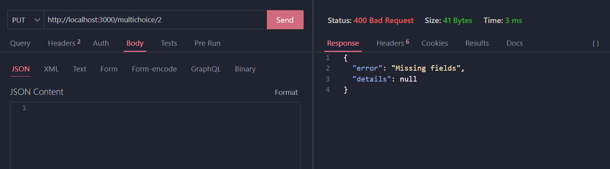

### PUT без полів, singlechoice

    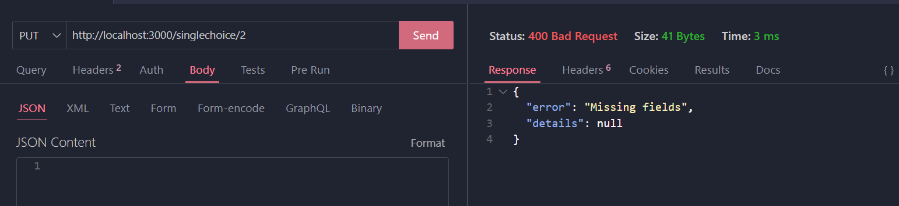

### PUT з неправильним id, multichoice

    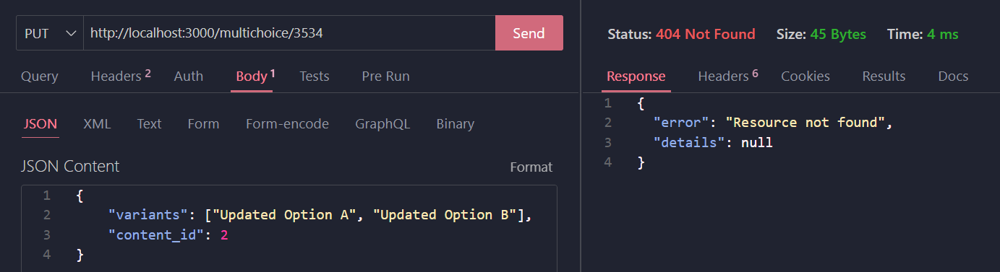

### PUT з неправильним id, singlechoice

    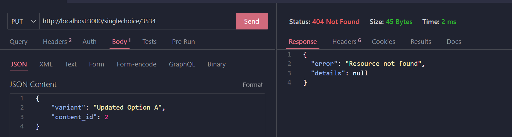

### DELETE з неправильним id, multichoice

    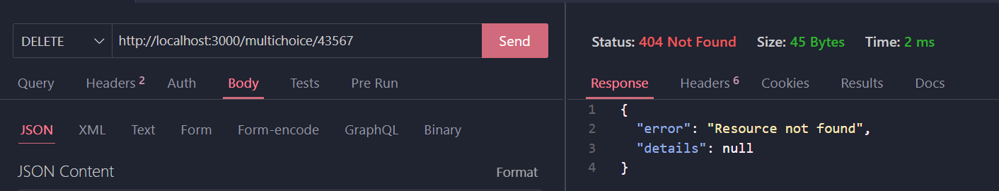

### DELETE з неправильним id, singlechoice

    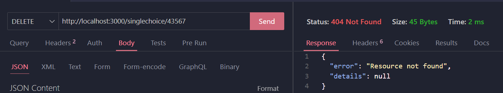

